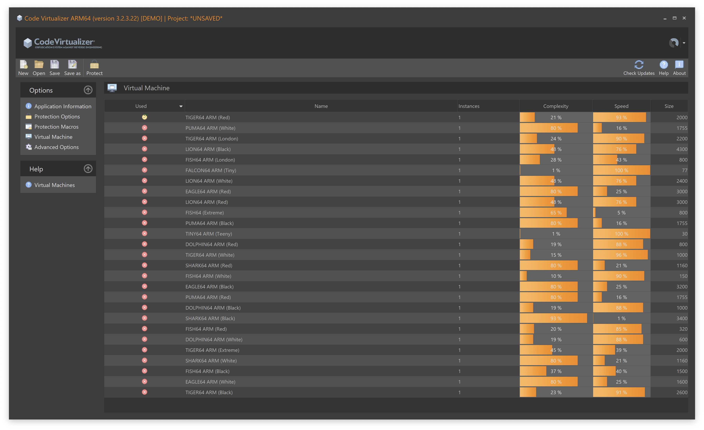
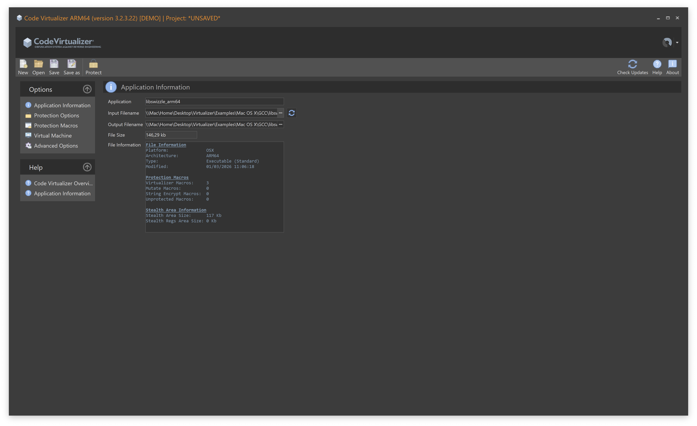
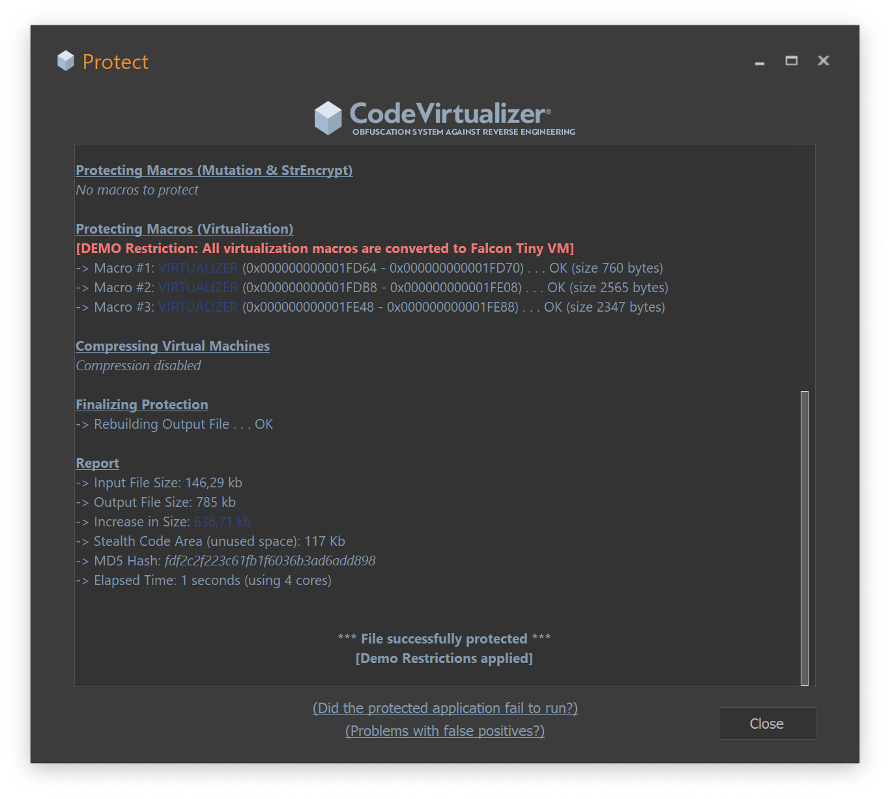

# Code Virtualizer Method Swizzling Demo

This project demonstrates [Oreans Code Virtualizer](https://www.oreans.com/CodeVirtualizer.php) protection applied to Objective-C method swizzling on macOS (arm64).

## Project Files

### Source Files

- `swizzle.m` - Dynamic library that performs Objective-C method swizzling
    - Protected with Code Virtualizer macros (`VIRTUALIZER_START`, `VIRTUALIZER_END`, `VIRTUALIZER_STR_ENCRYPT_START`, etc.)
    - Includes Stealth Code Area for additional anti-debugging protection

- `test_swizzle.m` - Test program to verify the swizzling functionality
    - Logs the output to demonstrate the effect of the swizzling

### Built Artifacts

- `libswizzle_arm64.dylib` - Unprotected version of the swizzling library
- `libswizzle_arm64_protected.dylib` - Protected version (virtualized with Code Virtualizer in Demo mode)
- `test_swizzle_arm64` - Compiled test executable

## Building

```bash
make all
```
- `libswizzle_arm64.dylib` : The swizzling dynamic library
- `test_swizzle_arm64` : The test executable

## Running the Demo
Note: SIP must be disabled to run the demo due to the use of `DYLD_INSERT_LIBRARIES` for method swizzling.
```bash
./scripts/demo_swizzle.sh
```

## Code Virtualizer Protection

The `swizzle.m` file demonstrates several Code Virtualizer features:

### Virtualization Macros
- `VIRTUALIZER_START` / `VIRTUALIZER_END` - Marks code sections to be virtualized
- `VIRTUALIZER_STR_ENCRYPT_START` / `VIRTUALIZER_STR_ENCRYPT_END` - Encrypts string literals
  
**Note:** `VIRTUALIZER_STR_ENCRYPT_START` is not available in the demo version.


### Stealth Code Area
The code includes a stealth area that:
- Provides additional anti-debugging protection
- Makes analysis more difficult
- Uses `STEALTH_AREA_START`, `STEALTH_AREA_CHUNK`, `STEALTH_AREA_END` macros




See [docs/logs.logs](docs/logs.logs) for available features applied to the demo.

## License

(c) 2024 Oreans Technologies  
All rights are reserved by Oreans.com

See [LICENSE](LICENSE) for the complete End User License Agreement.